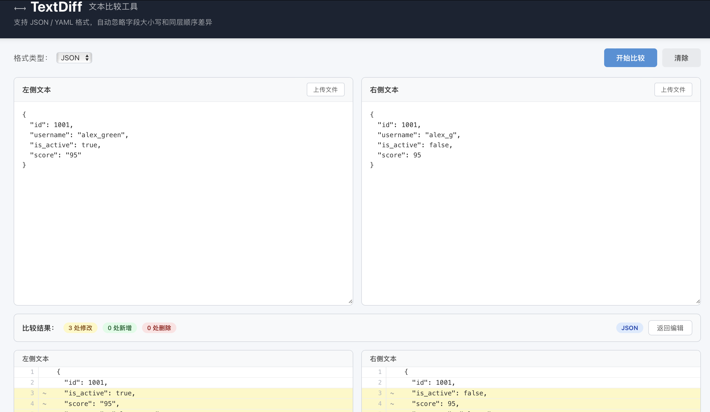

# TextDiff - 文本比较工具

一个基于 C/S 架构的文本比较工具，支持 **JSON** 和 **YAML** 两种格式的文本内容差异比较。


## 功能特性

- 🔍 **双格式支持**：支持 JSON 和 YAML 格式文本比较
- 🎯 **智能忽略**：自动忽略字段大小写差异
- 🔄 **顺序无关**：忽略同一层级字段的先后顺序
- 📄 **文件上传**：支持上传 `.json` / `.yaml` / `.yml` 文件
- 📋 **粘贴输入**：支持直接粘贴文本内容
- 🎨 **行级高亮**：差异行以不同颜色高亮（红/黄/绿）
- 📊 **统计摘要**：展示修改、新增、删除行数
- 📁 **标准化查看**：可展开查看标准化后的文本内容

## 技术栈

| 层级 | 技术 |
|------|------|
| 前端 | Vue 3 (Composition API) + Vite |
| 后端 | Python 3.12 + FastAPI |
| 解析 | PyYAML + Python json |
| 差异引擎 | Python difflib |

## 快速启动

### 1. 启动后端

```bash
cd TextDiff/backend
pip install -r requirements.txt
uvicorn main:app --host 0.0.0.0 --port 8000
```

后端将运行在 `http://localhost:8000`，API 文档访问 `http://localhost:8000/docs`。

### 2. 启动前端

```bash
cd TextDiff/frontend
npm install
npm run dev
```

前端将运行在 `http://localhost:5173`，浏览器打开即可使用。

> 前端开发服务器已配置代理，`/api/*` 请求自动转发到后端 `localhost:8000`。

### 3. 使用

1. 在顶部选择格式（JSON 或 YAML）
2. 在左右两侧分别输入或上传要比较的文本
3. 点击 **开始比较** 按钮
4. 查看差异结果：
   - 🟢 绿色 = 新增行
   - 🔴 红色 = 删除行
   - 🟡 黄色 = 修改行
5. 点击 **展开标准化后文本** 查看标准化处理后的结果

## API 接口

### `POST /api/compare`

比较两段文本的差异。

**请求体：**
```json
{
  "left_text": "{\"name\": \"Alice\", \"age\": 30}",
  "right_text": "{\"Name\": \"Bob\", \"Age\": 25}",
  "format": "json"
}
```

**响应体：**
```json
{
  "success": true,
  "has_diff": true,
  "format": "json",
  "left_normalized": "{\n  \"age\": 30,\n  \"name\": \"Alice\"\n}",
  "right_normalized": "{\n  \"age\": 25,\n  \"name\": \"Bob\"\n}",
  "diff_entries": [
    { "type": "equal", "left_line_num": 1, "right_line_num": 1, ... },
    { "type": "modified", "left_line_num": 2, "right_line_num": 2, ... }
  ],
  "summary": { "modified": 1, "added": 0, "removed": 0, "equal": 2 }
}
```

### `GET /api/health`

健康检查。

## 项目结构

```
TextDiff/
├── README.md                    # 项目说明
├── docs/
│   └── architecture.md          # 架构设计文档
├── backend/
│   ├── requirements.txt         # Python 依赖
│   ├── main.py                  # FastAPI 服务入口
│   └── diff_engine.py           # 核心差异比较引擎
└── frontend/
    ├── package.json             # NPM 依赖
    ├── vite.config.js           # Vite 打包配置
    ├── index.html               # 入口 HTML
    └── src/
        ├── main.js              # Vue 入口
        ├── App.vue              # 根组件
        ├── api/
        │   └── index.js         # API 客户端
        └── components/
            ├── ComparePanel.vue  # 主比较面板
            └── DiffView.vue     # 差异展示组件
```

## 标准化规则

比较时自动执行以下标准化：

1. **键名小写**：所有字典键转为小写（`Name` → `name`）
2. **键排序**：同一层级按字母排序
3. **列表保持顺序**：数组/列表元素位置不变
4. **值原样保留**：字符串值不转换大小写

## 开发说明

- 后端默认端口 `8000`，可通过 `--port` 参数修改
- 前端默认端口 `5173`，可在 `vite.config.js` 中修改
- 确保前后端端口匹配（代理配置）
